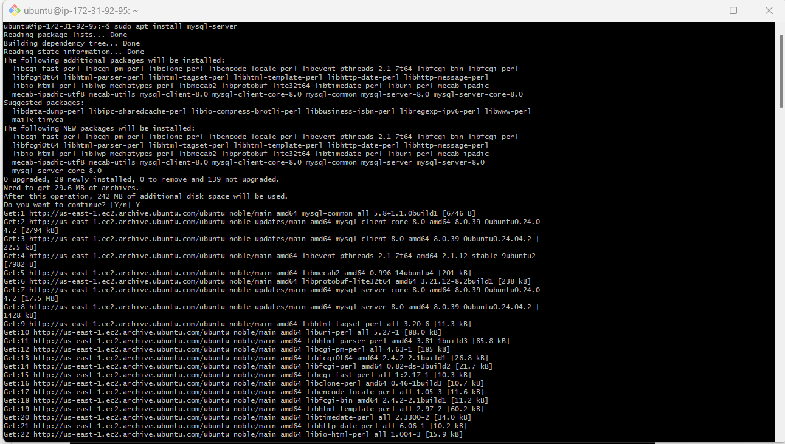
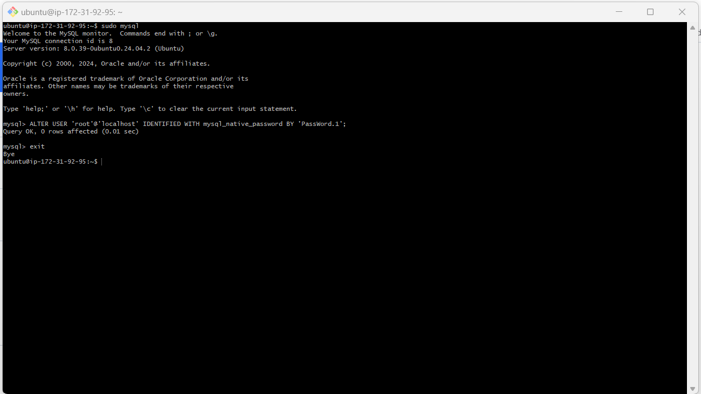
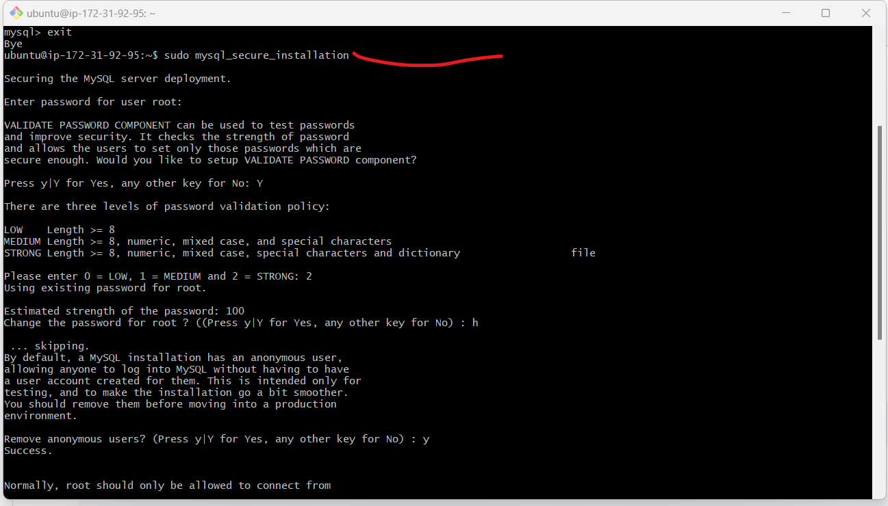
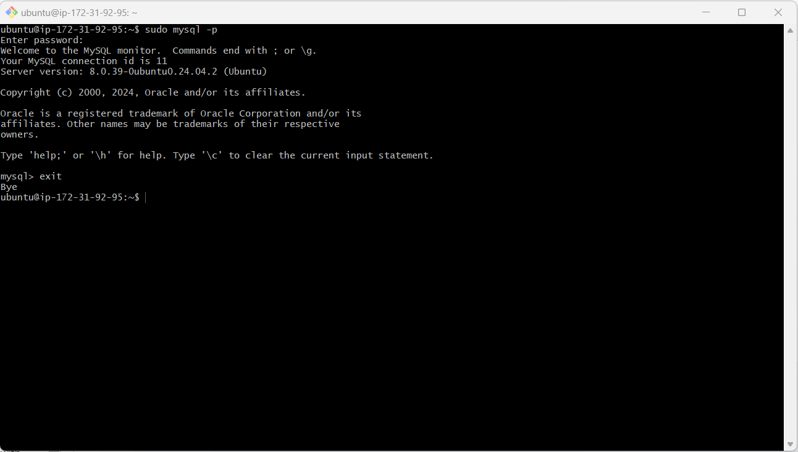
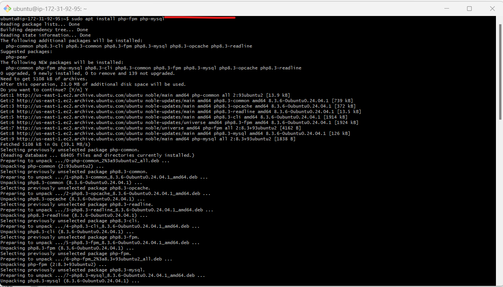
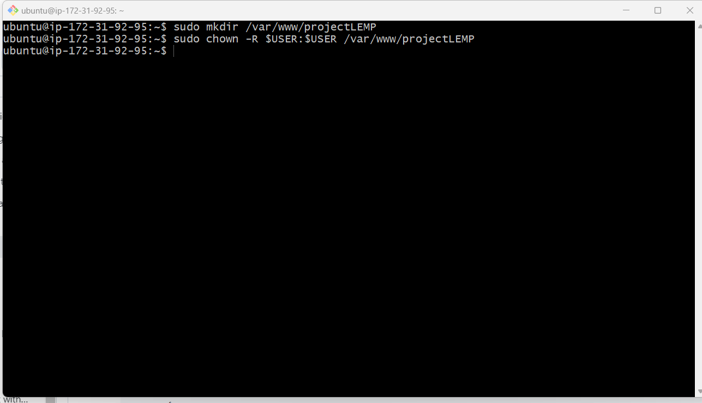
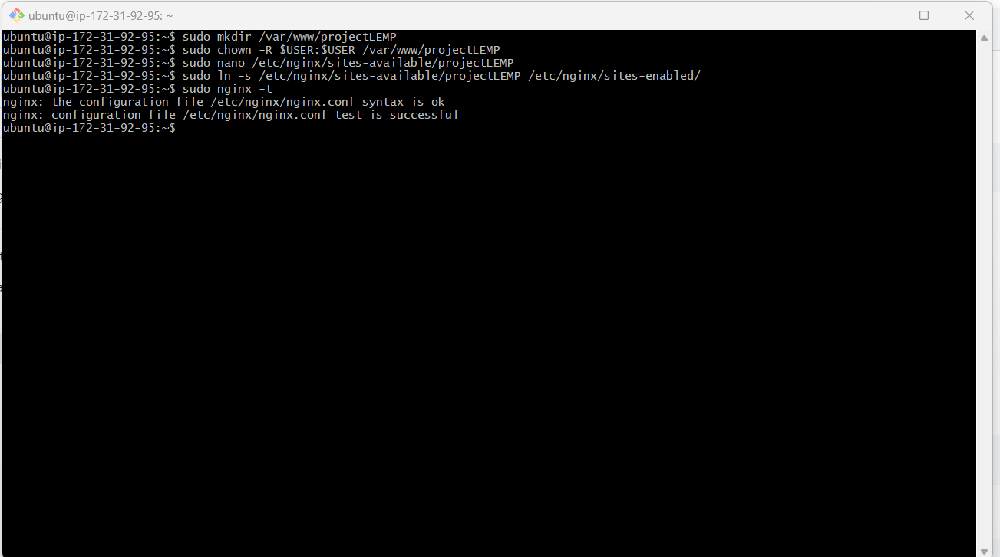
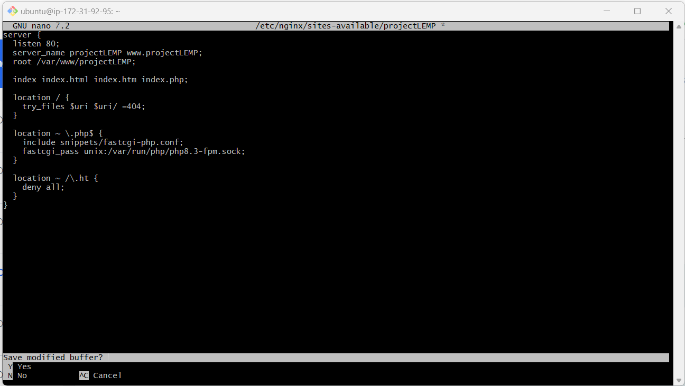
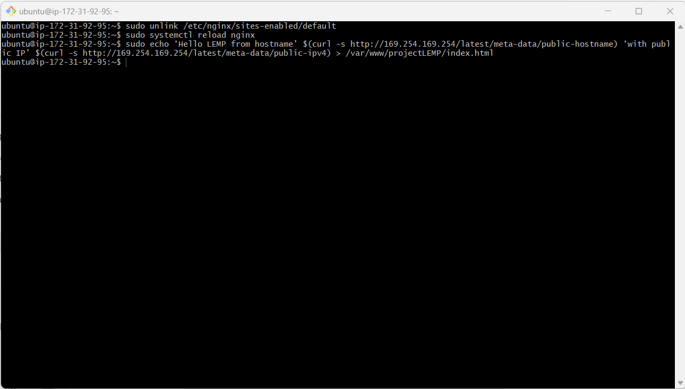

# Project Documentation: Deployment of LEMP Stack on EC2 Instance

## Overview
This repository contains documentation for setting up a LEMP (Linux, Nginx, MySQL, PHP) stack on an Amazon EC2 instance. The LEMP stack is a robust and popular web development environment that provides all the necessary components to run dynamic websites and web applications efficiently.

### Stack Components
Our setup utilizes the following technologies:

- **Linux:** Ubuntu Server 24.04 LTS
- **Engine-X (Nginx):** High-performance HTTP server
- **MySQL:** Reliable relational database management system
- **PHP:** Versatile server-side scripting language

This combination offers a powerful, scalable, and flexible platform for web development and deployment.

## Setting up the EC2 Instance

1. **Launch an EC2 Instance**: 
   - Sign in to the AWS Management Console.
   - Create a key pair
   - Navigate to EC2 Dashboard.
   - Click on "Launch Instance" and choose Ubuntu Server 24.04 LTS as the operating system.
     

2. **Configure Instance Details**:
   - Choose instance type, network, subnet, and other settings as per your requirements.


3. **Configure Security Group**:
   - Create a new security group or use an existing one.
   - Allow inbound traffic on ports 80 (HTTP), 22 (SSH), and 443 (HTTPS) from your IP address


4. **Review and Launch**:
 - Review the configuration and launch the instance.


5. **Connect to the Instance**:
   - Use Git Bash to connect to the instance via SSH.


8. **Grant Permission for the private key and SSH to the instance**
  - We then launch bash and go to the directory where our `.pem` file is.

```bash
$ cd downloads
```

Next, we run these commands to make sure our server is up and running

```
chmod 400 my-ec2-key.pem
ssh -i "my-ec2-key.pem" ubuntu@18.209.18.61
```


## Installing the Nginx Web Server

1. **Update Package Repository**:
   ```bash
   sudo apt update
   ```


2.**Install Nginx**
   ```bash
sudo apt install Nginx -y
```


3.**Enable and verify that Nginx is running on as a service on the OS**:
```bash
sudo systemctl status Nginx
```
If it green and running, then it is correctly installed


__4.The server is running and can be accessed locally in the ubuntu shell by running the command below:__

```
curl http://localhost:80
OR
curl http://127.0.0.1:80
```


5.**Test how Nginx can respond to request over the internet**
```
http://<public-ip address>:80
```


__6.__ __Another way to retrieve the public ip address other than check the aws console__

```
curl -s http://169.254.169.254/latest/meta-data/public-ipv4
```

## Installing Mysql
1. **mysql is popular relational database**:
   ```bash
   sudo apt install mysql-server
   ```


2.**log into mysql**:
   ```bash
   sudo mysql
   ```

3.**running a security script to set password for the root user using  mysql_native_password***:
   ```
   ALTER USER 'root'@'localhost' IDENTIFIED WITH mysql_native_password BY 'PassWord.1';
   ```

Exit the MySQL shell
```
exit
```


4.**Start the interactive script by running:**
```
sudo mysql_secure_installation
```


__5.__ __After changing root user password, log in to MySQL console.__

A command prompt for password was noticed after running the command below.
```
sudo mysql -p
```
Exit MySQL shell
```
exit
```


## Installing PHP
**To Install php, run**:

```bash
sudo apt install php-fpm php-mysql
```


## Configuring Nginx to use PHP processor

**Create a root web directory for your_domain:**

```bash
sudo mkdir /var/www/projectLEMP
```

**Next, we assign ownership of the directory with the $USER environment variable, which will reference our current system user:**

```bash
sudo chown -R $USER:USER /var/www/projectLEMP
```


Then, we open a new configuration file in nginx's `sites-available` using nano:

```bash
sudo nano /etc/nginx/sites-available/projectLEMP
```

This will create a new blank file. Paste in the following bare-bones configuration:

```bash
#/etc/nginx/sites-available/projectLEMP

server {
   listen 80;
   server_name projectLEMP www.projectLEMP;
   root /var/www/projectLEMP;

   index index.html index.htm index.php;

   location / {
       try_files $uri $uri/ =404;
   }

   location ~ \.php$ {
       include snippets/fastcgi-php.conf:
       fastcgi_pass unix:/var/run/php/php8.1-fpm.sock;
   }

   location ~ /\.ht {
       deny all;
   }

}
```
  

### Here’s what each directives and location blocks does:

- __listen__ - Defines what port nginx listens on. In this case it will listen on port 80, the default port for HTTP.

- __root__ - Defines the document root where the files served by this website are stored.

- __index__ - Defines in which order Nginx will prioritize the index files for this website. It is a common practice to list index.html files with a higher precedence than index.php files to allow for quickly setting up a maintenance landing page for PHP applications. You can adjust these settings to better suit your application needs.

- __server_name__ - Defines which domain name and/or IP addresses the server block should respond for. Point this directive to your domain name or public IP address.

- __location /__ - The first location block includes the try_files directive, which checks for the existence of files or directories matching a URI request. If Nginx cannot find the appropriate result, it will return a 404 error.

- __location ~ \.php$__ - This location handles the actual PHP processing by pointing Nginx to the fastcgi-php.conf configuration file and the php7.4-fpm.sock file, which declares what socket is associated with php-fpm.

- __location ~ /\.ht__ - The last location block deals with .htaccess files, which Nginx does not process. By adding the deny all directive, if any .htaccess files happen to find their way into the document root, they will not be served to visitors.

then we save and close the file.  
Next, we activate our configuration by linking the config file from nginx's `sites-enabled` directory.

```bash
sudo ln -s /etc/nginx/sites-available/projectLEMP /etc/nginx/sites-enabled/
```

This will tell nginx to use the configuration next time it is reloaded.  
We test our configuration for syntax eroors by:

```bash
sudo nginx -t
```

It should return:

```bash
nginx: the configuration file /etc/nginx/nginx.conf syntax is okay
nginx: configuration file /etc/nginx/nginx.conf test is successful
```


If any errors are reported, go back to your configuration file to review its contents before continuing.

We also need to disable default Nginx host that is currently configured to listen on port 80, for this run:

```bash
sudo unlink /etc/nginx/sites-enabled/default
```

When ready, we reload nginx and apply changes made.

```bash
sudo systemctl reload nginx
```

Our website is now active! We then create an index.html file in the location so that we can test that our new server block works as expected:

```bash
sudo echo 'Hello LEMP from Celyne Kydd' $(curl -s http://169.254.169.254/latest/meta-data/public-hostname) 'with public IP' $(curl -s http://169.254.169.254/latest/meta-data/public-ipv4) > /var/www/projectLEMP/index.html
```




